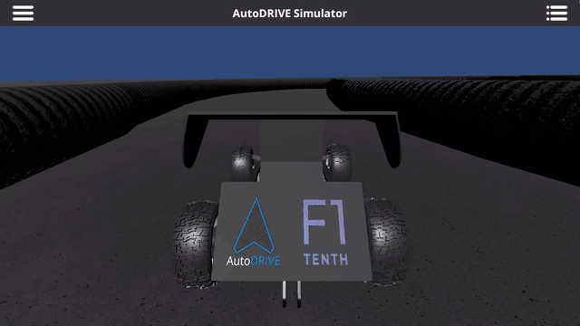

# AutoDRIVE-F110-RPP

Controlador **Regulated Pure Pursuit (RPP)** para el F1TENTH del simulador
AutoDRIVE, en ROS 2 Humble. Lee la trayectoria global suavizada de la
Parte 1 del proyecto, la sigue en pista. Incluye un contador y cronómetro
para medir el tiempo de cada vuelta en la terminal.

Segunda parte del proyecto final de Vehiculos no Tripulados. La primera parte
(mapeado con SLAM Toolbox, planificación con LPA\* y suavizado) en
[AutoDRIVE-F110-Global-Planner](https://github.com/Raulvillaes/AutoDRIVE-F110-Global-Planner).

> **Video en Youtube del controlador en funcionamiento:** [Regulated Pure Pursuit Controller in AutoDRIVE simulator (F1TENTH)](https://youtu.be/nKb0E7PGJLo).

## Indice

- [Resultado](#resultado)
- [Prerrequisitos](#prerrequisitos)
- [Instalación](#instalación)
- [Ejecución](#ejecución)
  - [Argumentos del launch](#argumentos-del-launch)
- [Trayectoria de entrada](#trayectoria-de-entrada)
- [Marcos de coordenadas: por que no hace falta localizacion](#marcos-de-coordenadas-por-que-no-hace-falta-localizacion)
- [El controlador](#el-controlador)
- [Contador de vueltas y cronometro](#contador-de-vueltas-y-cronometro)
- [Estructura del codigo](#estructura-del-codigo)
- [Interfaz ROS 2](#interfaz-ros-2)
- [Parametros](#parametros)
- [Sintonizacion](#sintonizacion)
- [Herramientas](#herramientas)

## Resultado

Diez vueltas consecutivas sin colisiones. Velocidad de crucero: a 2.7 m/s
de crucero, con el perfil de velocidad frenando a 1.1 m/s en la curva
de 1 m de radio (La primera vuelta se cuenta desde el frenado completado):

|   Vuelta   |   1   |   2   |   3   |   4   |   5   |   6   |   7   |   8   |   9   |   10  |
|    ---     |  ---  |  ---  |  ---  |  ---  |  ---  |  ---  |  ---  |  ---  |  ---  |  ---  |
| Tiempo (s) | 14.14 | 13.83 | 13.78 | 13.76 | 13.70 | 13.70 | 13.69 | 13.73 | 13.79 | 13.71 |



Vuelta de 27.85 m, velocidad media 1.96 m/s. Error lateral respecto a la
trayectoria de 12 cm (rms) y 26 cm maximo; holgura minima al muro vista
por el LiDAR de 1.02 m, y la regulacion por proximidad no llegó a actuar.
El lazo corre a la cadencia del puente en esa máquina, unos 10 Hz, con un
retardo mando -> efecto de 0.3 s compensado.

## Prerrequisitos

- [Ubuntu 22.04.5 LTS (Jammy)](https://releases.ubuntu.com/jammy/) y
  [ROS 2 Humble](https://docs.ros.org/en/humble/Installation/Ubuntu-Install-Debs.html).
- **Simulador AutoDRIVE** y su bridge de ROS 2 ya compilados en `~/autodrive_ws`,
  siguiendo el [Tutorial 1](https://github.com/nabihandres/AUTODRIVE/blob/main/Tutorial%201%3A%20AutoDrive%20Installation%20and%20Setup.md)
- La generación de ruta por planificación global se presenta en la
  [Parte 1](https://github.com/Raulvillaes/AutoDRIVE-F110-Global-Planner), pero ya hay
  una trayectoria cargada en este repositorio
  (ver [Trayectoria de entrada](#trayectoria-de-entrada)).

## Instalación

El repositorio es un paquete `ament_python`. Se clona dentro
de `src` del workspace del simulador y se compila con colcon:

```bash
cd ~/autodrive_ws/src
git clone git@github.com:Raulvillaes/AutoDRIVE-F110-RPP.git rpp_f110

cd ~/autodrive_ws
source /opt/ros/humble/setup.bash
source venv/bin/activate
colcon build --packages-select rpp_f110 --symlink-install
```

`--symlink-install` es opcional: permite editar `config/params.yaml` sin
recompilar.

## Ejecución

Para correr el controlador hacen falta el simulador y dos terminales bash:

**1. Abrir el simulador** `AutoDRIVE Simulator` desde el explorador o, si se
ha seguido el tutorial del curso, puede abrirse con:

```bash
~/Downloads/AutoDRIVE_Sim/AutoDRIVE\ Simulator.x86_64
```

**2. Bridge** (terminal 1):

```bash
cd ~/autodrive_ws
source /opt/ros/humble/setup.bash
source venv/bin/activate
source install/setup.bash
export PYTHONUNBUFFERED=1
ros2 launch autodrive_f1tenth simulator_bringup_headless.launch.py
```

Con `simulator_bringup_rviz.launch.py` se abre además RViz.

**3. Cambiar a Connected y Autonomous** dentro del simulador AutoDRIVE

**4. Controlador** (terminal 2):

```bash
cd ~/autodrive_ws
source /opt/ros/humble/setup.bash
source venv/bin/activate
source install/setup.bash
ros2 launch rpp_f110 rpp.launch.py
```

Arrancan tres nodos: `rpp_node` (control), `lap_node` (vueltas y
cronómetro, imprime en esta terminal) y `path_node` (visualización). Para
verlo en RViz se añaden `/rpp/path` (Path), `/rpp/lookahead` (Marker) y
`/rpp/finish_line` (Marker) con el marco fijo en `map`.

Al completar `total_laps` (defindas en `config/params.yaml`), si es un
valor mayor a 0 (10 por defecto), `lap_node` imprime el resumen y el
launch apaga todo; el controlador deja el acelerador a cero antes de salir.

**Rendimiento de la máquina.** El lazo de control corre a la cadencia del
simulador (unos 5 Hz). Si el simulador pierde cuadros porque la máquina
está cargada o tiene insuficientes recursos, el puente publica más lento,
la latencia crece y el coche subvira en las curvas cerradas.
Es convniente no tener nada más abierto y usar el puente *headless* si
RViz no hace falta, o en máquinas de bajos recursos.

### Argumentos del launch

```bash
ros2 launch rpp_f110 rpp.launch.py params_file:=/ruta/a/otro.yaml   # otros parametros
ros2 launch rpp_f110 rpp.launch.py log_csv:=/tmp/rpp.csv             # registro por ciclo
```

## Trayectoria de entrada

El controlador se alimenta de un CSV con la vuelta completa en el marco
`map`:

| Columna | Unidad | Significado                                      |
|---------|--------|--------------------------------------------------|
| `x`     | m      | posicion en el marco `map`                       |
| `y`     | m      | posicion en el marco `map`                       |
| `s`     | m      | longitud de arco acumulada desde el primer punto |
| `kappa` | 1/m    | curvatura con signo, positiva a izquierdas       |

La lista es **cíclica**: el ultimo punto empalma con el primero sin que se
repita ninguno.

**Ya hay un archivo listo:** `config/trajectory.csv` es una copia de la
salida de la Parte 1 (279 puntos a 0.10 m, vuelta de 27.85 m, radio de
giro minimo 1.01 m, holgura minima al muro 0.40 m). Asi el paquete se
ejecuta y se revisa sin correr LPA\*. Para regenerarla o usar otra:

```bash
git clone https://github.com/Raulvillaes/AutoDRIVE-F110-Global-Planner.git
cd AutoDRIVE-F110-Global-Planner
python3 -m venv venv && source venv/bin/activate
pip install -r requirements.txt
cd f1tenth && python f1tenth_map.py --no-anim
# resultado: f1tenth/resultados/trajectory.csv
```

y se apunta a ella con el parametro `trajectory_csv` de `rpp_node` y
`path_node` (vacio = la copia del paquete).

## Marcos de coordenadas: por que no hace falta localizacion

El puente de AutoDRIVE publica la pose verdadera del coche (el centro
del eje trasero) desde la transformación `map -> f1tenth_1` a partir
del IPS y la IMU del simulador. Ese `map` es el mismo sistema de
coordenadas del mapa generado con SLAM Toolbox sobre el que se planificó
la trayectoria en la Parte 1 y cae centrada en el carril (se comprobó
con `tools/check_frame.py pose` en aquel repositorio).

Por eso **los waypoints se consumen tal cual**. No hace falta AMCL,
ni filtro de particulas, ni cambio de marco.

Los nodos leen la pose de dos topics del bridge, `/autodrive/f1tenth_1/ips`
(posición) y `/autodrive/f1tenth_1/imu` (orientación), y no del TF. Son los
mismos números pero la entrega del TF se degrada con el tiempo: recién
lanzado el puente la latencia es de 1 ms, pero con el tiempo se degrada
hasta perder la mitad de las poses. Los topics de IPS e IMU salen de
publishers fijos y llegan siempre a la cadencia del simulador, unos 4 a 5 Hz.
El parámetro `pose_source` permite volver a `tf`.

## El controlador

### Pure Pursuit

En cada ciclo se busca el punto de la trayectoria mas cercano al coche y,
avanzando desde el, el primer punto a distancia `L_d` (el *lookahead*),
interpolado dentro de su segmento para que quede exactamente sobre la
circunferencia de radio `L_d`. Ese punto se expresa en el marco del
vehiculo; su coordenada lateral `y_L` fija la curvatura del arco que pasa
por el eje trasero, tangente al rumbo actual, y llega al punto:

```
gamma = 2 * y_L / L_d^2
```

Con el modelo de bicicleta cinematica (el marco del vehiculo esta en el eje
trasero, que es donde vale la formula) el angulo de las ruedas es

```
delta = atan(L * gamma)          L = 0.33 m (batalla)
```

y el simulador recibe un mando normalizado. Se midio contra el simulador
que la relacion es lineal y simetrica: mando 1.0 da 0.524 rad (30°), asi que

```
steering_command = delta / 0.524      saturado a [-1, 1]
```

La busqueda del punto mas cercano usa una ventana ciclica alrededor del
indice del ciclo anterior: el coche no puede haberse ido lejos en un ciclo
y asi no se confunde con otro tramo de pista que pase cerca (el circuito
tiene tramos paralelos separados por un muro). Si aun asi el mejor punto
queda a mas de 1 m, repite la busqueda sobre toda la vuelta.

### Lookahead adaptativo

```
L_d = clamp(lookahead_time * v_prevista, lookahead_min, lookahead_max)
```

Un lookahead corto sigue la trayectoria con precision pero oscila a
velocidad alta; uno largo es estable pero recorta las curvas. Escalarlo con
la velocidad da lo mejor de cada caso, y los limites evitan que a velocidad
cero apunte al punto mas cercano (inestable) o que en recta apunte
demasiado lejos.

La velocidad que escala `L_d` no es la medida ahora sino la que tendra el
coche cuando actue el mando, por coherencia con la
[compensacion del retardo](#compensacion-del-retardo): el Pure Pursuit se
aplica sobre la pose predicha `command_delay` segundos por delante, y en
ese intervalo el coche esta frenando para entrar en curva o acelerando al
salir. Con los parametros actuales la diferencia llega a
`max_decel * command_delay = 0.45 m/s`, un 17 % de `lookahead_max`, y va
siempre en el sentido malo: al entrar en curva el `L_d` se queda largo
justo donde recortar cuesta caro. Se estima llevando la velocidad medida
hacia la objetivo del ciclo previo dentro de los limites de aceleracion.
En la simulacion cerrada no empeora ningun escenario y gana cuanto peor es
el caso (a 5 Hz, error lateral de 7.1 a 5.9 cm rms y de 4.7 a 4.0 cm en
curva; con 0.45 s de retardo, vuelta de 18.5 a 17.9 s y traqueteo del
mando un 17 % menor).

Cuanto recorta se puede estimar: el arco del Pure Pursuit se separa de la
cuerda hasta `L_d^2 / (8 r)`. En la curva de 1 m de radio, `L_d = 0.8 m`
desvia 8 cm, `L_d = 1.65 m` desvia 34 cm y `L_d = 2.5 m` desvia 78 cm, con
0.6 m de semiancho de pista. Por eso el lookahead en curva tiene que ser
corto, y lo que permite acortarlo sin oscilar es la
[compensacion del retardo](#compensacion-del-retardo).

### Compensacion del retardo

Entre publicar un mando y ver su efecto en la pose pasan `command_delay`
segundos (0.5 a 1 s en el puente de AutoDRIVE, ver
[Retardo y estabilidad](#retardo-y-estabilidad)). Los mandos publicados en
ese intervalo todavia no han actuado. Antes de aplicar el Pure Pursuit se
integra el modelo de bicicleta con esos mandos pendientes y la velocidad
medida:

```
x    += v cos(yaw) dt
y    += v sin(yaw) dt
yaw  += v tan(delta_i) / L * dt        para cada mando pendiente delta_i
```

y el punto mas cercano, el lookahead y la curvatura se calculan desde esa
pose predicha, que es donde estara el coche cuando el mando de este ciclo
llegue a las ruedas (`prediction.py`). El servo de direccion tampoco es
instantaneo: en la integracion el angulo real de las ruedas persigue al
mandado como un sistema de primer orden con constante `steering_lag`.
Con `command_delay = 0` se desactiva y el controlador es el RPP sin mas.
Los dos tiempos se miden con `tools/measure_delay.py` en cada maquina.

La simulacion cerrada de `tools/closed_loop_sim.py` (bicicleta cinematica,
retardo puro, servo de primer orden y el acelerador medido, a 4.5 Hz) da
la medida de lo que aporta cada pieza con los parametros actuales y un
retardo real de 0.5 s mas un servo de 0.15 s:

| Compensacion | Vueltas | Error lateral rms / max |
|---|---|---|
| ninguna (`command_delay = 0`) | no completa una vuelta | 0.70 / 1.64 m |
| retardo puro (`steering_lag = 0`) | 13.5 s | 0.19 / 0.44 m |
| retardo + servo (config actual) | 13.3 s | 0.13 / 0.27 m |
| sin retardo en el simulador | 12.9 s | 0.06 / 0.15 m |

Y lo sensible que es al valor: con el retardo real 0.2 s por encima o por
debajo del configurado el error rms sube a 0.3 m, y con retardos reales de
0.8 s o mas ni bien compensado baja de 0.3 m a 2.7 m/s. El retardo es el
parametro que mas importa y hay que medirlo en la maquina donde se corre.

### Las tres regulaciones

Lo que distingue al RPP del Pure Pursuit clasico es que la velocidad
objetivo no es fija: parte de `max_speed` y pasa por tres regulaciones.

1. **Curvatura.** Si el radio `r` baja de `regulated_min_radius`, la
   velocidad escala linealmente con el radio: `v = max_speed * r / r_min`.
   Se aplica por dos vias y manda la menor:
   - al arco actual del Pure Pursuit, `r = 1 / |gamma|`: lo que el coche
     esta girando ahora, incluida la correccion del error lateral;
   - al camino que viene, como un **perfil de velocidad** calculado una
     vez sobre el CSV (`trajectory.speed_profile`): velocidad de curva de
     cada punto por su `kappa`, una pasada hacia atras que limita cada
     punto a lo que permite frenar con `max_decel` hasta el siguiente
     (`v_i <= sqrt(v_{i+1}^2 + 2 a ds)`) y una hacia delante con
     `max_accel`. El coche frena justo lo necesario antes de cada curva, en
     lugar de rodar a velocidad de curva desde una distancia fija, y un
     pico de ruido en `kappa` no produce un frenazo.
   - La regla lineal `v = max_speed * r / r_min` tiene un defecto fisico:
     la aceleracion lateral `v^2 / r` crece con el radio, asi que las
     curvas abiertas se toman con mas aceleracion lateral que las
     cerradas. En el registro se midio que por encima de unos 2 m/s² la
     guinada real queda un 10 a 20 % por debajo de la cinematica (el coche
     subvira y se abre). Por eso hay un tope `v <= sqrt(max_lateral_accel * r)`
     en las dos vias. Con los parametros actuales el perfil da una vuelta
     ideal de 13.7 s frente a los 16 s de la regla anterior (maximo de
     `kappa` a 2 m por delante).
2. **Proximidad.** El LiDAR mira un sector frontal de `proximity_fov`
   grados. Si la distancia libre minima `d` baja de `proximity_distance`,
   `v = v * proximity_gain * d / proximity_distance`. En el circuito sin
   obstaculos es una red de seguridad: dentro de una curva el sector
   frontal apunta al muro exterior, asi que el sector es estrecho (20°) y
   la distancia corta (1 m) para que no frene una curva bien tomada.
3. **Aceleracion.** La velocidad objetivo no puede cambiar mas de
   `max_accel * dt` al subir ni de `max_decel * dt` al bajar entre ciclos.
   Suaviza los escalones que dejan las dos anteriores.

Despues de las dos primeras se aplica un suelo `min_speed`, para que ninguna
regulacion deje el coche parado en mitad de la pista.

### De velocidad a mando de acelerador

El simulador no acepta una velocidad: acepta un mando de acelerador
normalizado en [-1, 1], y tampoco publica la velocidad del coche. Se midio
la velocidad estacionaria que da cada mando (ver
[Sintonizacion](#sintonizacion)) y se invierte esa curva como
prealimentacion, con una correccion proporcional sobre la velocidad medida:

```
throttle = throttle_offset + throttle_per_mps * v_objetivo
         + speed_kp * (v_objetivo - v_medida)
```

saturado a `[throttle_min, throttle_max]`. Con `throttle_min = 0` el coche
frena por inercia; un valor negativo permite freno motor.

### Medicion de la velocidad

El simulador tampoco publica la velocidad. Hay dos fuentes y un parametro
`speed_source` para elegir:

- `tf` (la que se usa): desplazamiento entre dos poses consecutivas
  dividido por el tiempo entre ellas, proyectado sobre el rumbo (con signo)
  y con un filtro exponencial `speed_filter`. A 5 Hz y con la pose exacta
  del simulador es limpia: oscila 0.05 m/s alrededor de la consigna.
- `encoders`: derivada del angulo de cada encoder de rueda por el radio de
  rueda `wheel_radius`. **Descartada:** el puente repite el mismo angulo en
  todos los mensajes aunque el coche vaya a 1.5 m/s, y la derivada sale
  constante (3.37 rad/s parado o en marcha).

### Retardo y estabilidad

Entre publicar un mando y ver su efecto en la pose pasan entre 0.5 y 1 s:
el puente saliente escribe el mando en un archivo que el puente entrante
lee en el siguiente lote, el simulador lo aplica y el servo de direccion
tiene su propia dinamica. Con ese retardo el Pure Pursuit oscila si el
tiempo de lookahead `L_d / v` se acerca al retardo: con `L_d / v = 1.0 s`
el coche entro en la recta con 5° de rumbo desviado y el zigzag crecio
(24, 31 y 37 cm) hasta el muro. Con `lookahead_time = 1.5 s` la correccion
se amortigua, pero un lookahead tan largo recorta las curvas cerradas.
La salida es compensar el retardo (arriba): controlando desde la pose
predicha el lazo ve el efecto de sus mandos "a tiempo" y el lookahead
puede acortarse, pero no en recta: con `L_d = 1.0 m` a 2.7 m/s
(`L_d / v = 0.37 s`, casi el retardo) el mando zigzagueaba con periodo de
0.6 s y ±0.25 de amplitud aunque el error lateral fuera de 3 cm. Con
`lookahead_time = 0.55 s` y maximo 1.5 m el lookahead es 1.5 m en la recta
(mando cuatro veces mas quieto) y 1.0 m en las curvas a 1.9 m/s, que es lo
que evita abrirse en las eses.

## Contador de vueltas y cronometro

`lap_node` es independiente del controlador: solo lee el TF. La linea de
meta es el segmento de muro a muro `(1.47, 3.16) -> (0.29, 3.16)`, el mismo
que en la Parte 1 hace de muro virtual para obligar a planificar la vuelta
entera; el coche aparece sobre ella mirando a `-y`.

Un cruce es el **paso orientado del segmento**: entre dos poses
consecutivas cambia el signo de la distancia a la recta, el punto de cruce
cae dentro del segmento, y el desplazamiento va en el sentido de la carrera
(`finish_direction`). No se detecta por distancia a un punto: con eso una
pasada lenta o una parada sobre la meta contarian doble. Dos protecciones
mas: hay que alejarse `rearm_distance` de la linea para rearmar el conteo,
y una vuelta mas corta que `min_lap_time` se descarta.

El **instante del cruce se interpola** entre las dos poses que abrazan la
linea, asi que el cronometro tiene mas resolucion que la cadencia del
puente. El reloj arranca cuando el coche empieza a moverse; si la salida
queda antes de la meta, el primer cruce lo sincroniza con la linea.

Por cada vuelta imprime en la terminal el numero, el tiempo de la vuelta,
la mejor y el acumulado:

```
==================================================
  VUELTA 3 COMPLETADA
  Tiempo de vuelta:      13.78 s
  Mejor vuelta:          13.78 s
  Tiempo acumulado:      41.75 s
==================================================
```

## Estructura del codigo

```
rpp_f110/
  rpp_node.py       controlador RPP: /tf + LiDAR -> throttle_command, steering_command
  lap_node.py       contador de vueltas y cronometro: /tf -> terminal
  lap_counter.py    logica del cruce orientado y del cronometro (sin ROS, con pruebas)
  path_node.py      trayectoria como nav_msgs/Path y meta como Marker para RViz
  trajectory.py     carga del CSV, geometria ciclica (punto mas cercano, lookahead) y perfil de velocidad
  prediction.py     pose predicha con los mandos pendientes (compensacion del retardo, sin ROS)
  vehicle_pose.py   pose del vehiculo desde /tf (map -> f1tenth_1) y guinada del cuaternion
config/
  params.yaml       parametros de los tres nodos
  trajectory.csv    copia de la trayectoria de la Parte 1
launch/
  rpp.launch.py     lanza los tres nodos; apaga todo cuando lap_node termina
tools/
  measure_speed.py  escalon de acelerador: velocidad estacionaria, cadencia, frenada
  measure_delay.py  escalones de direccion: retardo mando -> efecto, para command_delay
  estimate_delay.py retardo por correlacion mando/realimentacion sobre un registro log_csv
  closed_loop_sim.py simulacion cerrada del nodo sin AutoDRIVE (bicicleta + retardo + servo)
  replay_pose.py    publica /tf recorriendo el CSV, para probar sin simulador
test/
  test_trajectory.py, test_prediction.py, test_lap_counter.py   pruebas con pytest
```

Funciones principales de `rpp_node.py`:

| Funcion | Que hace |
|---|---|
| `on_pose` | ciclo de control completo, disparado por cada pose del TF |
| `regulate_curvature` | regulacion 1 (arco actual): velocidad proporcional al radio |
| `remember_steering` | guarda los mandos publicados para la prediccion |
| `regulate_proximity` | regulacion 2: velocidad proporcional a la distancia libre del LiDAR |
| `limit_acceleration` | regulacion 3: limite de cambio de velocidad por ciclo |
| `speed_to_throttle` | velocidad objetivo a mando de acelerador |
| `on_scan` | distancia libre minima en el sector frontal |
| `on_encoder`, `update_tf_speed` | las dos estimaciones de velocidad |
| `check_pose_timeout` | acelerador a cero si el puente deja de publicar |
| `stop_vehicle` | ceros al salir: el puente conserva el ultimo mando recibido |

En `trajectory.py`: `nearest_index` (ventana ciclica con rebusqueda global),
`lookahead_point` (primer punto a `L_d`, interpolado) y `speed_profile`
(regulacion 1 sobre el camino, con distancia de frenada). En
`prediction.py`: `predict_pose`. En
`lap_counter.py`: `crossing` (cruce orientado e instante interpolado) y
`update` (estado del contador).

## Interfaz ROS 2

| Dir | Topic | Tipo | Nodo | Descripcion |
|---|---|---|---|---|
| Sub | `/tf` | `tf2_msgs/TFMessage` | rpp, lap | pose `map -> f1tenth_1` del puente |
| Sub | `/autodrive/f1tenth_1/lidar` | `sensor_msgs/LaserScan` | rpp | regulacion por proximidad |
| Sub | `/autodrive/f1tenth_1/left_encoder`, `right_encoder` | `sensor_msgs/JointState` | rpp | velocidad por encoders |
| Pub | `/autodrive/f1tenth_1/throttle_command` | `std_msgs/Float32` | rpp | acelerador normalizado [-1, 1] |
| Pub | `/autodrive/f1tenth_1/steering_command` | `std_msgs/Float32` | rpp | direccion normalizada [-1, 1] |
| Pub | `/rpp/lookahead` | `visualization_msgs/Marker` | rpp | punto objetivo |
| Pub | `/rpp/target_speed`, `/rpp/measured_speed` | `std_msgs/Float32` | rpp | para `rqt_plot` |
| Pub | `/rpp/path` | `nav_msgs/Path` | path | trayectoria |
| Pub | `/rpp/finish_line` | `visualization_msgs/Marker` | path | linea de meta |

## Parametros

Todos en `config/params.yaml`. Los valores son los de las vueltas de
[Resultado](#resultado).

### `rpp_node`

| Parametro | Valor | Descripcion |
|---|---|---|
| `trajectory_csv` | `""` | CSV de la trayectoria; vacio = `config/trajectory.csv` |
| `wheelbase` | 0.33 m | batalla, del TF de la rueda delantera |
| `max_steering_angle` | 0.524 rad | angulo con mando 1.0, medido |
| `lookahead_time` | 0.55 s | `L_d = lookahead_time * v`: 1.5 m en recta, 1.0 m en curva |
| `lookahead_min`, `lookahead_max` | 0.8, 1.5 m | limites de `L_d` |
| `command_delay` | 0.5 s | retardo puro mando -> efecto que se compensa; 0 = sin compensar |
| `steering_lag` | 0.15 s | constante de tiempo del servo de direccion en la prediccion |
| `max_speed` | 2.7 m/s | velocidad de crucero |
| `min_speed` | 0.5 m/s | suelo de la regulacion por curvatura |
| `regulated_min_radius` | 2.5 m | radio por debajo del cual frena (arco y perfil) |
| `max_lateral_accel` | 1.8 m/s² | tope `v <= sqrt(a_lat * r)`; 0 = sin tope |
| `proximity_distance` | 1.0 m | distancia libre a la que empieza a frenar |
| `proximity_gain` | 1.0 | ganancia de la regulacion por proximidad |
| `proximity_fov` | 20° | abertura del sector frontal del LiDAR |
| `max_accel`, `max_decel` | 2.0, 1.5 m/s² | limite de aceleracion y frenada, tambien en el perfil |
| `throttle_offset`, `throttle_per_mps` | 0.0, 0.2 | prealimentacion: 5 m/s por unidad de mando, medido |
| `speed_kp` | 0.05 | correccion proporcional (con retardo, mas ganancia se pasa de velocidad) |
| `throttle_min`, `throttle_max` | 0.0, 1.0 | saturacion del acelerador |
| `speed_source` | `tf` | `tf` o `encoders` |
| `wheel_radius` | 0.058 m | solo para `encoders` |
| `speed_filter` | 0.5 | peso de la muestra nueva en el filtro de velocidad |
| `pose_source` | `sensors` | `sensors` (IPS + IMU) o `tf` |
| `pose_timeout` | 1.0 s | sin poses -> acelerador a cero |
| `log_csv` | `""` | registro por ciclo para sintonizar |

### `lap_node`

| Parametro | Valor | Descripcion |
|---|---|---|
| `finish_line` | `[1.47, 3.16, 0.29, 3.16]` | meta de muro a muro, en `map` |
| `finish_direction` | `[0.0, -1.0]` | sentido de la carrera al cruzar |
| `min_lap_time` | 5.0 s | descarta cruces antes de este tiempo |
| `rearm_distance` | 1.0 m | distancia a la meta para rearmar |
| `total_laps` | 10 | resumen y apagado al completarlas; 0 = sin limite |
| `progress_period` | 0.0 s | >0: imprime la vuelta en curso cada tanto |
| `pose_source` | `sensors` | igual que en `rpp_node` |

## Sintonizacion

Todo lo que sigue se midio contra el simulador; nada sale de una hoja de
datos.

### Direccion

Con `tools/check_frame.py steering` de la Parte 1: el mando de direccion es
lineal y simetrico, sin zona muerta, y 1.0 da 0.524 rad. Positivo gira a
la izquierda, como en ROS (comprobado con el registro: mando positivo,
guinada creciente).

### Retardo

`tools/measure_delay.py` aplica escalones alternos de direccion y mide
cuanto tarda la realimentacion `steering` del puente (y, en marcha, la
guinada del IMU) en responder. Con el modelo de retardo puro `T` mas servo
de primer orden `tau`, el tiempo al 10 % del escalon es `T`
(`command_delay`) y el tiempo al 90 % es `T + 2.3 tau`, de donde
`steering_lag = (t90 - t10) / 2.2`. En marcha usa escalones pequenos y
cortos y se corta si el LiDAR ve pared. La otra forma, sin prueba aparte:
`tools/estimate_delay.py /tmp/rpp.csv` correlaciona en cualquier registro
`log_csv` el mando de direccion con la realimentacion del puente y con la
guinada del IMU (el registro guarda las dos desde esta version) y da los
dos tiempos.

Medido en la maquina de las vueltas de [Resultado](#resultado): parado,
la realimentacion del servo responde entre 0.19 y 0.40 s despues del
mando (mediana 0.32 s) y salta al valor final en una sola muestra del
puente (7.5 Hz), asi que el servo es mas rapido que el muestreo. En marcha,
por correlacion sobre 92 s de registro: 0.26 s hasta el servo y 0.30 s
hasta la guinada (correlacion 1.00 y 0.82). De ahi `command_delay = 0.3`
y `steering_lag = 0.05`. La realimentacion viene en radianes (0.262 con
mando 0.5), lo que confirma los 0.524 rad del mando 1.0.

### Acelerador

`tools/measure_speed.py` aplica escalones de mando en la recta de salida y
mide la velocidad estacionaria por la pose:

| Mando | Velocidad estacionaria | Tiempo al 90 % |
|------:|-----------------------:|---------------:|
| 0.15 | 0.71 m/s | 2.0 s |
| 0.30 | 1.51 m/s | 1.0 s |
| 0.50 | 2.48 m/s | ~1 s |

Es lineal, unos 5 m/s por unidad de mando y sin zona muerta: de ahi
`throttle_per_mps = 0.2` y `throttle_offset = 0`. Con mando 0.0 el coche
frena solo a unos 3 m/s² (de 1.5 m/s a parado en 0.6 m), asi que
`throttle_min = 0` basta para frenar. La correccion proporcional
`speed_kp = 0.1` compensa el error residual: a consigna 1.2 m/s la
velocidad medida oscila entre 1.15 y 1.25.

### Pasadas de lazo cerrado

| Pasada | Crucero | `L_d` | Otros | Resultado |
|---|---|---|---|---|
| 1 | 1.0 m/s | 0.6 s, [0.6, 1.3] | pose por `/tf` | oscilacion creciente en la recta y muro a los 6 m; el lazo recibia 2 Hz |
| 2 | 1.0 m/s | 1.0 s, [1.0, 2.0] | pose por IPS + IMU | vuelta de 30.5 s; muro en la vuelta 3 al entrar en la curva cerrada con 29 cm de error arrastrado |
| 3 | 1.2 m/s | 1.0 s, [0.8, 2.0] | + curvatura anticipada 1.5 m, radio 1.5 m, proximidad 1.0 m | 4 vueltas de 26 s; zigzag en la recta en la vuelta 5 |
| 4 | 1.2 m/s | 1.5 s, [1.0, 2.5] | igual | vueltas de 25.3 s, sin tocar el muro |
| 5 | 1.2 m/s | 1.5 s, [0.8, 2.5] | radio 2.0 m, curvatura anticipada 2.0 m | 10 vueltas limpias de 30.4 a 32.4 s, 72 % del tiempo regulada por curvatura |
| 6 | 2.7 m/s | 1.5 s, [0.8, 2.5] | radio 2.5 m, acel. 2.0 / 2.2 | vueltas de 17 s, roces laterales en curva y frenadas en tramos casi rectos |
| 7 | 2.7 m/s | 1.2 s, [0.8, 1.5] | perfil de velocidad, retardo compensado 0.3 s, frenada 1.5 | 28.2, 15.2 y 19.5 s; en la ese de los indices 130-170 se abre 0.3 m en la curva de 2 m de radio y toca el muro interior de la siguiente |
| 8 | 2.7 m/s | 0.5 s, [0.8, 1.0] | + tope lateral 1.8 m/s² | 10 vueltas limpias de 14.3 a 14.8 s, error 7 cm rms, pero zigzag del mando en la recta (periodo 0.6 s) |
| 9 | 2.7 m/s | 0.55 s, [0.8, 1.5] | igual | **10 vueltas limpias de 13.7 a 14.1 s** ([Resultado](#resultado)); sin zigzag, error 12 cm rms |

Tres lecciones. La primera, el retardo del mando fija el lookahead minimo:
por debajo de `L_d / v = 1.5 s` el coche zigzaguea, salvo que se compense
el retardo. La segunda, la regulacion por curvatura del arco actual llega
tarde: el arco al lookahead solo se cierra cuando el coche ya esta en la
curva; hay que mirar el CSV por delante. La tercera, mirar una distancia
fija por delante (pasadas 3 a 6) frena de mas: tomaba el maximo de `kappa`
a 2 m y rodaba a velocidad de curva en tramos de 5 a 40 m de radio; con
el tiempo teorico de esa regla en 16 s, la pasada 6 (17 s) ya estaba en
su limite. De ahi el perfil con distancia de frenada y la compensacion
del retardo, que ademas permite el lookahead corto que evita los roces
laterales por recorte de curva. La pasada 7 anadio la cuarta: con
`L_d = 1.5 m` en una ese de radios 2 m el objetivo cae ya en la curva
siguiente, el mando se relaja antes de salir de la actual y el coche se
abre; con `L_d <= 1.0 m` y el retardo compensado el error se queda en
7 cm rms. En esa misma pasada se midio el subviraje (guinada real un 10 a
20 % por debajo de la cinematica por encima de 2 m/s² laterales), origen
del tope `max_lateral_accel`. La pasada 8 mostro la otra cara: 1.0 m en
recta a 2.7 m/s zigzaguea. El escalado con la velocidad (pasada 9) da
1.5 m en recta y 1.0 m en curva y resuelve las dos cosas a la vez.

### Como sintonizar

1. Poner `log_csv` en `config/params.yaml` a una ruta; cada ciclo escribe
   pose medida y predicha, indice, lookahead, curvatura, mandos, realimentacion
   del servo, guinada, velocidades y distancia libre.
2. Lanzar, dejar varias vueltas, y mirar el error lateral respecto a
   `config/trajectory.csv` y la distancia libre minima.
3. Medir el retardo con `tools/measure_delay.py` y poner `command_delay`
   y `steering_lag`. Un error de 0.2 s en cualquier sentido ya se nota;
   si el retardo medido pasa de 0.8 s, empezar con `max_speed` 2.0.
4. Subir `max_speed` de 0.2 en 0.2 m/s comprobando 10 vueltas cada vez;
   si zigzaguea en recta, subir `lookahead_time` o revisar
   `command_delay`; si se abre en las curvas, subir `regulated_min_radius`
   o bajar `max_decel`; si roza el muro interior en curva, bajar
   `lookahead_max`.

## Herramientas

- `tools/measure_speed.py MANDO`: aplica un escalon de acelerador con la
  direccion a cero, corta cuando el LiDAR ve pared cerca y graba la
  frenada. Imprime cadencia del puente, velocidad estacionaria, radio de
  rueda implicito y deceleracion, y guarda un CSV.
- `tools/measure_delay.py`: escalones alternos de direccion, parado o en
  marcha (`--throttle`), y tiempo al 10, 50 y 90 % de la realimentacion
  del servo y a la reaccion de la guinada. Da `command_delay`.
- `tools/closed_loop_sim.py`: simulacion cerrada sin AutoDRIVE del nodo
  real (`RppNode`) sobre una bicicleta cinematica con retardo puro, servo
  y acelerador medidos. Da vueltas, error lateral y velocidad maxima para
  un archivo de parametros y un retardo simulado; es lo que se uso para
  fijar la compensacion del retardo. Necesita ROS 2 sourceado.
- `tools/replay_pose.py`: publica `/tf` recorriendo el CSV a velocidad
  constante. Sirve para probar `lap_node` y `rpp_node` sin simulador.
- Pruebas unitarias de la geometria y del contador:

```bash
cd ~/autodrive_ws/src/rpp_f110
PYTEST_DISABLE_PLUGIN_AUTOLOAD=1 python3 -m pytest test
```
